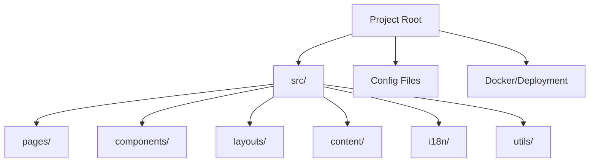

# Codebase Map

The macro layout: the top-level areas and what each holds. A map to navigate, not the full tree.

## Areas

- `src/pages/[lang]/`: File-based dynamic bilingual routes.
- `src/components/`: Reusable Astro components.
- `src/layouts/`: Shared layout components.
- `src/content/{blog,projects}/{lang}/`: Content collections defined in `content.config.ts`.
- `src/i18n/`: Translation keys (`ui.ts`) and lang-resolution utilities.
- `src/utils/`: Shared utilities (`formatDate`, `getRelatedItems`, `urls.ts`).
- `src/assets/`, `src/styles/`: Static assets and global styles.

## Entry points

- `src/pages/index.astro`: The main landing page.
- `astro.config.mjs`: The Astro configuration file.
