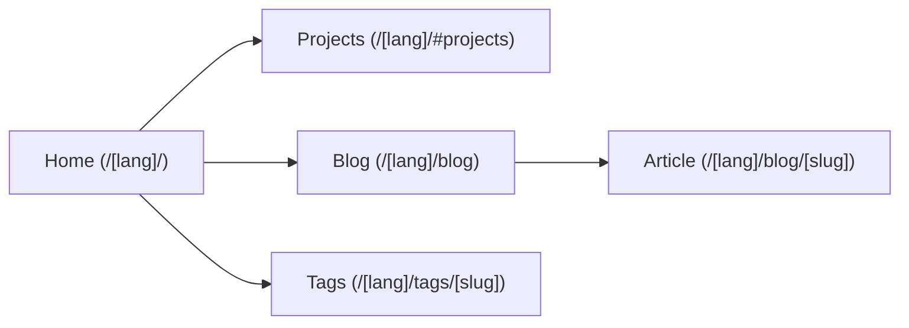

# Navigation

How the user moves through the app: routing and the page structure.

## Routing

- Astro's file-based routing with dynamic parameters (`src/pages/[lang]/`).
- Fully bilingual (French/English): all URLs require a language prefix (`/fr/`, `/en/`).
- Canonical URLs and `href` links are built using the `getBlogPostUrl()` utility.
- Sitemap generation via `@astrojs/sitemap`.

## Structure

The macro page map, main sections only.

