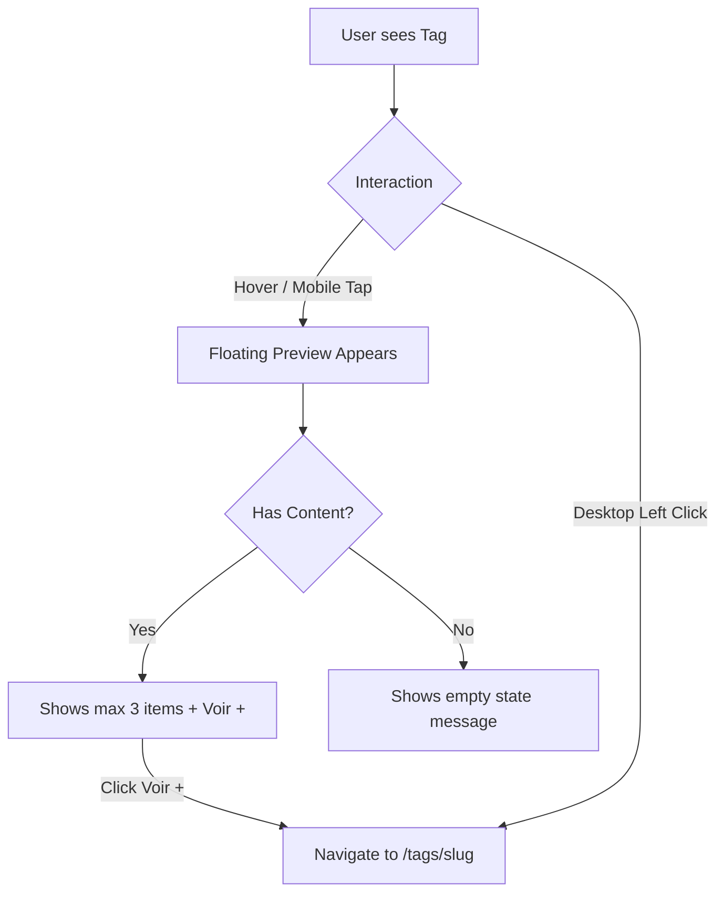

# Instruction: Interactive Universal Tags

## Feature

- **Summary**: Transform static tags into interactive hubs. Hovering a tag shows up to 3 related projects/articles. Clicking the tag goes to a dedicated `/tags/[tag]` page. Tags are centralized in a new Astro data collection.
- **Stack**: `Astro 5`, `TypeScript`, `CSS`
- **Branch name**: `feat/interactive-tags`
- **Parent Plan**: `none`
- **Sequence**: `standalone`
- Confidence: 9/10
- Time to implement: 1-2 sessions

## Architecture projection

### Files to modify

- `src/content.config.ts` - Add a new `tags` data collection to act as the source of truth.
- `src/components/ui/Tag.astro` - Refactor to include the floating preview HTML and hover logic, transforming it into a custom element if JS is needed for mobile interactions.
- `src/components/sections/Stack.astro` - Fetch tags from the collection and pass them to the interactive tags.

### Files to create

- `src/data/tags.json` - Centralized JSON dictionary defining all tag properties (name, icon, color).
- `src/pages/tags/[slug].astro` - Dynamic route to generate a dedicated page for each tag, listing all its associated projects and blog posts.

### Files to delete

- None

## Applicable rules

| Tool   | Name | Path | Why it applies |
| ------ | ---- | ---- | -------------- |
| Cursor | Routing | `AGENTS.md` | Guide for adding dynamic pages (`/tags/[slug].astro`) |
| Cursor | Collections | `AGENTS.md` | Guide for defining the new `tags` collection |

## User Journey

## Risk register

| Risk | Impact | Mitigation |
| ---- | ------ | ---------- |
| Mobile Tooltip Overflow | The floating preview could break out of the viewport on small screens. | Use CSS `max-width`, viewport-relative positioning or native Popover API to keep it on-screen. |
| Performance overhead | Fetching related items for every single tag on the page might slow down the build. | Leverage Astro's fast static generation and `getCollection` caching. The lookup is purely at build-time. |

## Implementation phases

### Phase 1: Centralize Tags

> Create the single source of truth for tags.

#### Tasks

1. Create `src/data/tags.json` and migrate all existing tags from `Stack.astro` into it.
2. Update `src/content.config.ts` to define the `tags` data collection using the file loader.
3. Update `Stack.astro` to pull tags from `getCollection('tags')` instead of the hardcoded array.

#### Acceptance criteria

- [ ] `tags` collection is successfully registered and type-checked.
- [ ] The Stack section renders identically but data is sourced from the new collection.

### Phase 2: The Tag Preview Component

> Build the interactive floating menu for tags.

#### Tasks

1. Refactor `src/components/ui/Tag.astro` to include a tooltip container.
2. Write a utility function to fetch the 3 most recent projects and blog posts that include the tag.
3. Render the fetched items in the tooltip, or a fallback "Bientôt des projets..." message if empty.
4. Implement the CSS hover logic for desktop, and a tiny Web Component `<interactive-tag>` script to handle the tap logic on mobile (first tap opens, second tap clicks links).

#### Acceptance criteria

- [ ] Hovering a tag on desktop shows the preview.
- [ ] Tapping a tag on mobile shows the preview without instantly navigating.
- [ ] Tooltip stays within the screen bounds.

### Phase 3: Dedicated Tag Pages

> Generate the `/tags/[slug]` pages.

#### Tasks

1. Create `src/pages/tags/[slug].astro`.
2. Implement `getStaticPaths()` to generate a page for every tag in the collection.
3. Build the page UI: A header describing the tag, followed by a grid of related Projects and Blog Posts.

#### Acceptance criteria

- [ ] Clicking a tag or "Voir +" navigates to `/tags/[slug]`.
- [ ] The page lists all expected content for that tag.

## Amendments

## Log

## Validation flow demonstration

1. Go to the homepage.
2. Hover over the "React" tag in the Stack section -> The preview shows up to 3 projects/articles.
3. Click on the "React" tag -> You are navigated to `/tags/react`.
4. Go back and hover over a tag with no projects (e.g. "C") -> The preview says "Pas de référence pour le moment".
5. Test on a mobile device -> Tap once on "React", the preview opens. Tap on a project inside the preview to navigate to it.
