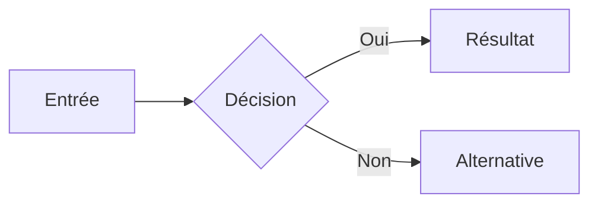

# Contenu du portfolio

Le contenu éditorial est organisé en collections Astro typées. Un fichier français et un fichier anglais partagent le même nom afin de conserver les mêmes URL dans les deux langues.

## Ajouter un projet

1. Ajouter une capture, une photographie ou un visuel réel du projet dans `src/assets/projects/`.
2. Copier un fichier existant dans `projects/fr/<slug>.mdx` et `projects/en/<slug>.mdx`.
3. Renseigner le frontmatter. `featured: true` affiche le grand dossier illustré ; `featured: false` affiche une ligne dans « Autres travaux ». `order` contrôle l'ordre dans chaque groupe.
4. Écrire le contenu détaillé sous le frontmatter avec la syntaxe Markdown ou MDX.

```mdx
---
title: "Nom du projet"
description: "Résumé court et factuel."
tags: ["Astro", "TypeScript"]
year: 2026
featured: true
order: 1
githubUrl: "https://github.com/..."
coverImage: "../../../assets/projects/image.png"
coverAlt: "Description précise de l'image"
coverPresentation: "screenshot"
coverCaption: "Capture réelle de l'application"
gallery:
  - image: "../../../assets/projects/autre-vue.jpg"
    alt: "Description précise de la seconde image"
    caption: "Ce que montre cette vue"
    presentation: "photo"
role: "Mon rôle sur le projet"
context: "Projet personnel, professionnel ou universitaire"
proof:
  - value: "Valeur"
    label: "Ce que cette valeur représente"
status: "live"
---

## Le problème

Décrire le besoin avant la solution.
```

`status` accepte `live`, `wip` ou `archived`. Les propriétés `liveUrl` et `githubUrl` sont facultatives. Pour un projet secondaire, `coverImage` et `coverAlt` peuvent être omis ensemble.

Les images locales JPEG, PNG, WebP, AVIF ou TIFF passent par **Sharp**, déjà intégré à Astro. Le composant génère des tailles adaptées ainsi que des versions AVIF et WebP, avec un PNG ou JPEG de repli. Les GIF animés conservent leur animation. Les médias de projets remplissent toujours leur cadre en `cover`, y compris les logos et les captures ; `coverPresentation` et `gallery[].presentation` conservent uniquement une indication sémantique et de fond (`logo`, `screenshot` ou `photo`). Le SVG reste techniquement accepté pour un diagramme, mais les quatre grands projets utilisent des fichiers raster réels.

Pour placer un visuel au moment où il éclaire le récit — plutôt qu’en galerie à la fin — importer `ProjectStoryMedia` et l’image locale dans le MDX. Le composant conserve les conversions AVIF/WebP, les tailles responsives et une légende cohérente avec les cadres du portfolio.

```mdx
import ProjectStoryMedia from '../../../components/content/ProjectStoryMedia.astro';
import dashboard from '../../../assets/projects/mon-projet/dashboard.png';

<ProjectStoryMedia
  src={dashboard}
  alt="Tableau de bord du projet avec les éléments utiles visibles"
  caption="Le tableau de bord utilisé pour configurer le projet."
/>
```

Les légendes doivent dire clairement si l'image montre le produit, une identité visuelle ou une contribution personnelle.

## Ajouter un diagramme

Les pages projet rendent automatiquement les blocs Mermaid. Aucun import MDX n'est nécessaire.

````md

````

Mermaid permet aussi les diagrammes de séquence, d'état, de classes, entité-relation, Gantt, mindmap et timeline. En cas d'échec JavaScript, le code source du diagramme reste lisible dans la page.

## Ajouter une expérience ou un diplôme

Créer deux fichiers de même nom dans `journey/fr/` et `journey/en/`.

```mdx
---
type: "experience"
title: "Intitulé"
organization: "Organisation"
location: "Ville ou À distance"
period: "Depuis 2026"
order: 1
current: true
tags: ["Java", "Agile"]
---

Description courte, concrète et compréhensible sans connaître l'organisation.
```

Pour un diplôme, utiliser `type: "education"` et ajouter éventuellement `credential`.

## Ajouter une certification

Créer deux fichiers MDX de même nom dans `certifications/fr/` et `certifications/en/`. La section « Certifications » du parcours reste absente tant qu'aucun fichier n'existe dans la langue affichée. Ne renseigner que des certifications réellement obtenues ; ne pas ajouter de badge ou d'organisme fictif.

```mdx
---
title: "Nom exact de la certification"
issuer: "Organisme émetteur"
issued: "2026-10"
order: 1
verificationUrl: "https://exemple.org/verification/identifiant"
credentialId: "Identifiant public"
expires: "2029-10"
image: "../../../assets/certifications/badge.png"
imageAlt: "Badge officiel de la certification"
---

Une phrase factuelle sur les compétences ou l'évaluation couvertes.
```

`title` et `issuer` sont obligatoires ; `issued` (format `AAAA-MM`) l'est pour une certification réelle. `verificationUrl`, `credentialId`, `expires`, `image`, `imageAlt` et le texte MDX sont facultatifs. Si une image est fournie, son texte alternatif est obligatoire. Les images locales fixes sont converties en AVIF/WebP avec un format de repli ; les GIF animés conservent leur animation. Un lien de vérification n'est affiché que si une URL réelle est fournie. Ne pas publier de pièce contenant des données personnelles non destinées à être publiques.

Pour prévisualiser une carte sans prétendre avoir obtenu la certification, utiliser `example: true` dans un fichier MDX bilingue, sans date d'obtention, identifiant ni lien de vérification. Une telle carte apparaît uniquement avec le serveur de développement et reste exclue du site compilé pour publication. Pour la remplacer par une vraie certification, renseigner les données authentiques, retirer `example: true` et ajouter `issued` dans les deux langues.

## Modifier le projet de stage international

La fiche « prochaine étape » est définie dans `internship/fr/brief.mdx` et `internship/en/brief.mdx`. Le frontmatter contrôle son titre, son résumé, les trois informations pratiques et l'objet du lien de contact ; le paragraphe sous le frontmatter précise ce que j'apporte à l'équipe. Les deux versions doivent rester cohérentes. Ne pas indiquer de dates, de pays, de niveau de langue ou de résultats qui n'ont pas été confirmés.
