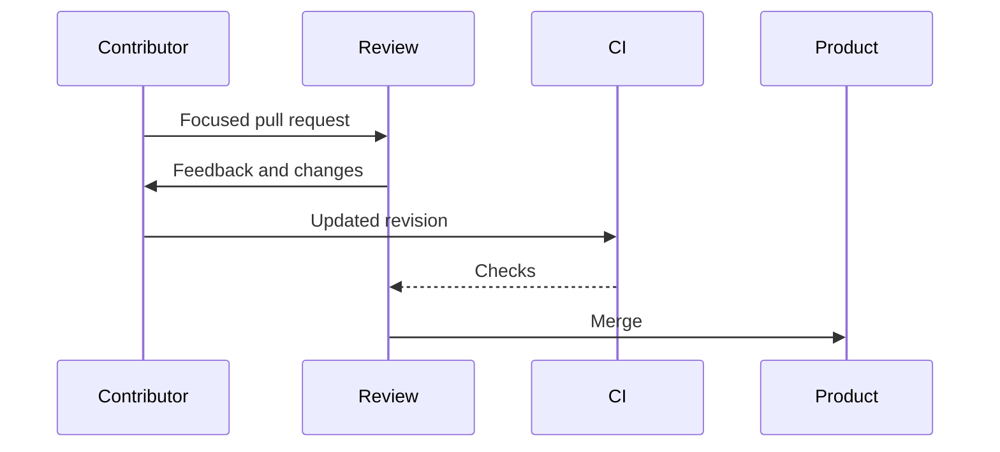

## Contributing to an existing product

Jan is an open-source application for running language models locally. My work focuses on the Agent Builder and several chatbot interface improvements.

## How I contribute

- Learn the conventions of a codebase already used by a community.
- Split changes into focused, reviewable units.
- Collaborate through issues and pull requests.
- Account for CI results and maintainer feedback before integration.

## What it demonstrates

Beyond implementation, this experience demonstrates my ability to join an existing product, document decisions and evolve an interface without breaking established usage.

