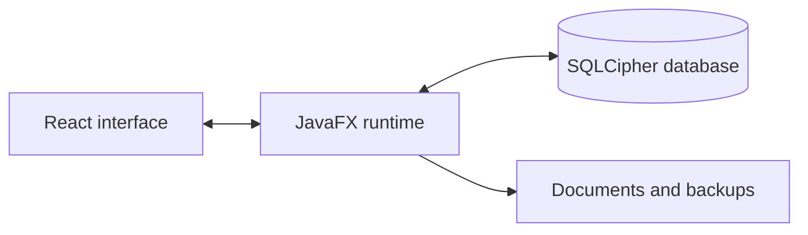

## A business tool that needs to be dependable

Kinect brings people records, appointments and documents together in a Windows application that does not require a traditional installation. The work extends beyond the interface: local data must remain available and protected through updates, backups and document editing.

## What I built

- A React interface embedded in a JavaFX application.
- An encrypted local database with SQLCipher.
- Workflows for records, documents and appointments.
- Portable distribution and checks before ejecting the storage device.

## Simplified architecture

## What matters here

For a CRM, a polished screen is not enough: an interrupted edit or incomplete copy can lose data. This project led me to treat errors, backups and recovery states as user journeys in their own right.
