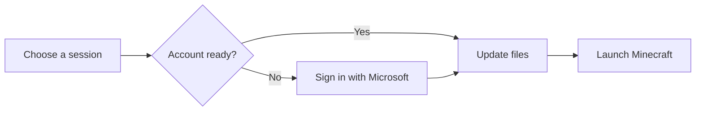

import ProjectStoryMedia from '../../../components/content/ProjectStoryMedia.astro';
import launchedHome from '../../../assets/projects/launched/launched_home.png';
import launchedCreator from '../../../assets/projects/launched/launched_creator.png';

## Where it started

Joining a modded Minecraft server often means finding the right modpack, checking its version, adding an account and hoping nothing has been missed. The player ends up doing the setup work instead of the product.

Launched turns that journey into a clear session: choose it, let the application prepare the environment, then play. The goal is not to be just another launcher, but to give a community its own game space without asking it to build an installation by hand.

## Player side

The main screen stays intentionally simple. One active session, server status and a **Play** button. When preparation is needed, that button becomes clear progress instead of leaving the player in front of a silent screen.

A session carries its Minecraft version, any loader — Forge, Fabric, NeoForge or Quilt — and the files to synchronize. That makes it possible to switch between worlds without rebuilding an installation every time.

## Creator side

The public website introduces Launched and provides the download. It also leads to a creator space: this is where what appears in the launcher is prepared.

<ProjectStoryMedia
  src={launchedHome}
  alt="Launched website home page with its download action"
  caption="The public site: introduce the project and lead to the download or creator space."
/>

In this space, a creator configures a session: Minecraft version, loader, memory, server address, welcome message and folders to synchronize. They can publish or hide it, add useful links and invite collaborators. Game files and visuals are placed in an SFTP space associated with the session.

<ProjectStoryMedia
  src={launchedCreator}
  alt="Launched dashboard showing sessions, their SFTP access and options"
  caption="The creator dashboard: configure a session and prepare what players will receive in the launcher."
/>

This is not only for uploading a modpack. A creator can provide their background, logo, icon and links. The launcher retrieves them through the site API and displays them in session selection and during play. Each community keeps its own identity without needing a custom client.

## Under the hood

The launcher interface is built with **React and TypeScript**. **Tauri** connects it to a **Rust** core that handles system-level work: dependency installation, local files and game launch.

Synchronization compares files already present with the session manifest, downloads what changed and removes obsolete items in the relevant folders. Every file is checked against its MD5 checksum. The client then reports the current file, the number of items processed and a percentage: enough detail to explain the wait without turning the screen into a console.

Microsoft authentication uses the OAuth device-code flow. Settings keep defaults, with per-session adjustments for memory, JVM arguments and logs. The application also checks for its own updates from within the client.

## Project status

The planned features are in place: a session created on the site becomes an identifiable experience in the launcher, from the first sync to the Play button. The remaining work is product stabilization and fixing bugs found in use.
