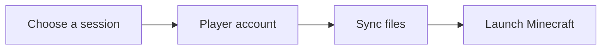

## The problem

Joining a Minecraft server requires an account, a game version, the right resources and updates. Launched brings that journey into one dedicated desktop application.

## The technical response

- A React interface packaged with Tauri.
- Minecraft session and server selection.
- File synchronization before launching the game.
- Account and per-session settings management.

## Main flow

## Focus

The launcher coordinates a web interface with native operations. The journey must remain understandable while synchronization is running, even when a server or download responds slowly.
