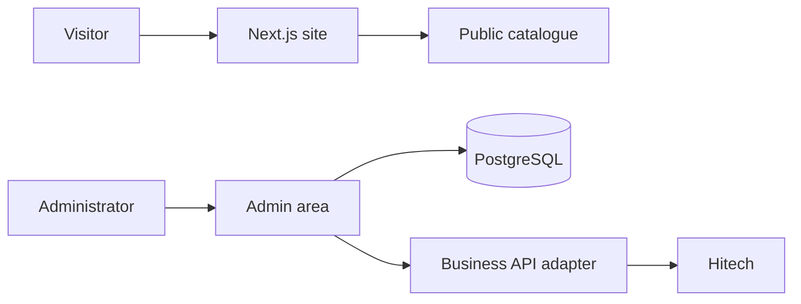

## Connecting a public website to business data

Loc'Evasion 14 presents its rental and shuttle services online. The project also includes an editable vehicle catalogue and a server layer that communicates with the existing business API.

## What the project covers

- Public pages for services, agencies and routes.
- A vehicle catalogue with image and publication state management.
- Authentication for administration tools.
- A server-side API gateway with caching and coordinated access to external data.

## Simplified flow

## Focus

The website must not invent available vehicles when the business service fails. Catalogue states and technical errors therefore stay distinct so the journey remains understandable.
