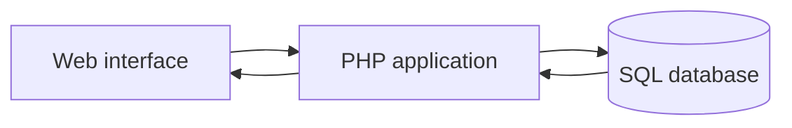

## A complete project

SAE 301 covers an application's full cycle: data design, server-side business logic and integration of an interface that can be used by its audience.

## Responsibilities practiced

- Modeling and using an SQL database.
- Building features in PHP.
- Integrating frontend code with the server.
- Organizing collaborative work with Git.
- Applying initial protections against SQL injection and XSS attacks.

## Architecture

