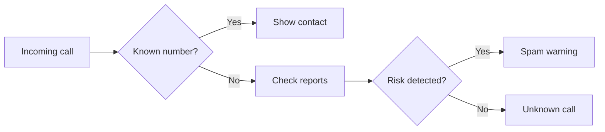

## The need

YCallMe explores a clearer way to manage calls by separating known contacts, numbers that need verification and potentially unwanted calls.

## What I built

- A native Android application written in Kotlin.
- An interface designed to expose a call's status at a glance.
- Asynchronous processing to preserve a responsive mobile experience.
- An architecture that can accommodate additional detection sources.

## What this project demonstrates

This project lets me work on mobile architecture, Android system constraints and the presentation of data that must be understood within seconds.

