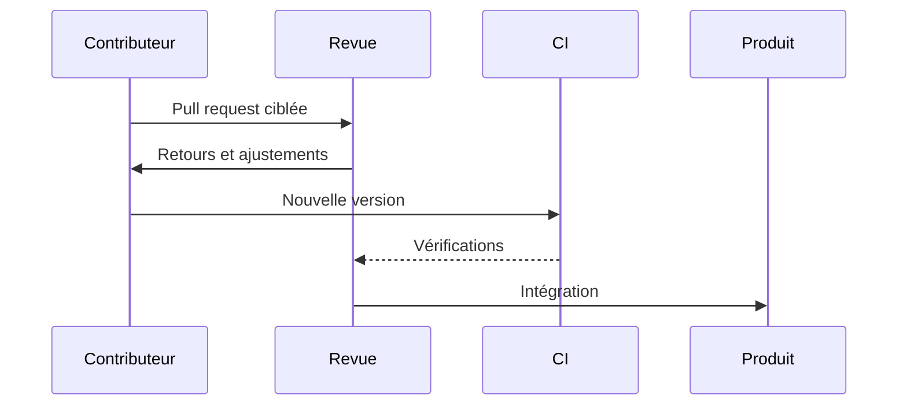

## Contribuer dans une base existante

Jan est une application open source qui permet d'utiliser des modèles de langage localement. Ma contribution porte sur l'Agent Builder et sur plusieurs ajustements d'interface du chatbot.

## Ma manière de travailler

- Comprendre les conventions d'une base de code déjà utilisée par une communauté.
- Découper une modification pour faciliter la revue.
- Échanger au travers des issues et des pull requests.
- Tenir compte de la CI et des retours des mainteneurs avant intégration.

## Ce que cela prouve

Au-delà du code, cette expérience montre ma capacité à rejoindre un produit existant, à documenter mes choix et à faire évoluer une interface sans casser ses usages établis.

