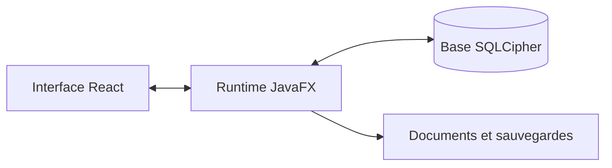

## Un outil métier qui doit rester fiable

Kinect regroupe les fiches de personnes, les rendez-vous et les documents dans une application utilisable sur Windows sans installation classique. Le sujet va au-delà de l'interface : les données locales doivent rester disponibles et protégées lors des mises à jour, des sauvegardes et de l'édition des documents.

## Ce que j'ai construit

- Une interface React intégrée dans une application JavaFX.
- Une persistance locale chiffrée avec SQLCipher.
- Des workflows pour les fiches, les documents et les rendez-vous.
- Une distribution portable et des contrôles avant éjection du support.

## Architecture simplifiée

## Le point important

Sur un CRM, un écran réussi ne suffit pas : une édition interrompue ou une copie incomplète peut coûter des données. Le projet m'a amené à traiter les erreurs, les sauvegardes et les états de récupération comme des parcours utilisateur à part entière.
