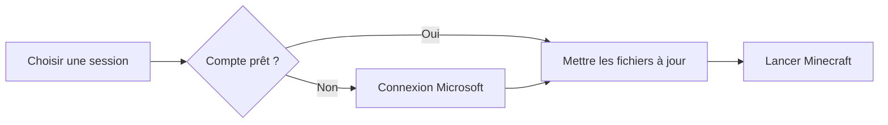

import ProjectStoryMedia from '../../../components/content/ProjectStoryMedia.astro';
import launchedHome from '../../../assets/projects/launched/launched_home.png';
import launchedCreator from '../../../assets/projects/launched/launched_creator.png';

## Le point de départ

Pour rejoindre un serveur Minecraft moddé, on doit souvent récupérer le bon modpack, vérifier sa version, ajouter son compte et espérer ne rien avoir oublié. Le joueur fait le travail de configuration à la place du produit.

Launched transforme ce parcours en une session claire : on la choisit, l’application prépare l’environnement, puis on joue. L’ambition n’est pas d’être un launcher de plus, mais de donner à une communauté son propre espace de jeu sans lui demander de fabriquer une installation manuelle.

## Côté joueur

L’écran principal reste volontairement simple. Une session active, l’état du serveur et un bouton **Jouer**. Quand une préparation est nécessaire, ce bouton devient une progression lisible au lieu de laisser le joueur devant un écran qui ne dit rien.

Une session embarque sa version de Minecraft, son loader éventuel — Forge, Fabric, NeoForge ou Quilt — et les fichiers à synchroniser. On peut donc passer d’un univers à l’autre sans reconstruire son installation à chaque fois.

## Côté créateur

Le site public introduit Launched et donne accès au téléchargement. Il mène aussi vers un espace créateur : c’est là que l’on prépare ce qui apparaîtra dans le launcher.

<ProjectStoryMedia
  src={launchedHome}
  alt="Page d’accueil du site Launched avec l’action de téléchargement"
  caption="Le site public : présenter le projet et amener vers le téléchargement ou l’espace créateur."
/>

Dans cet espace, un créateur configure sa session : version de Minecraft, loader, mémoire, adresse de serveur, message d’accueil et dossiers à synchroniser. Il peut la publier ou la masquer, ajouter des liens utiles et inviter des collaborateurs. Les fichiers de jeu et les visuels sont déposés dans un espace SFTP associé à la session.

<ProjectStoryMedia
  src={launchedCreator}
  alt="Tableau de bord Launched affichant des sessions, leurs accès SFTP et leurs options"
  caption="Le tableau créateur : configurer une session et préparer ce que les joueurs recevront dans le launcher."
/>

Cette partie ne sert pas seulement à déposer un modpack. Le créateur peut fournir son arrière-plan, son logo, son icône et ses liens. Le launcher les récupère via l’API du site et les affiche dans la sélection de sessions et pendant le jeu. Chaque communauté garde ainsi sa propre identité sans avoir besoin d’un client personnalisé.

## Ce qui se passe sous le capot

L’interface du launcher est construite avec **React et TypeScript**. **Tauri** fait le lien avec un cœur **Rust** qui gère les opérations proches du système : installation des dépendances, fichiers locaux et lancement du jeu.

La synchronisation compare les fichiers présents avec le manifeste de la session, télécharge ce qui a changé et retire les éléments devenus obsolètes dans les dossiers concernés. Chaque fichier est contrôlé avec son empreinte MD5. Le client remonte ensuite le fichier en cours, le nombre d’éléments traités et le pourcentage : assez de détail pour comprendre l’attente, sans transformer l’écran en console.

L’authentification Microsoft passe par le flux OAuth avec code appareil. Les réglages gardent des valeurs par défaut, avec des ajustements possibles par session pour la mémoire, les arguments JVM et les logs. L’application vérifie enfin ses propres mises à jour depuis le client.

## État du projet

Les fonctionnalités prévues sont en place : une session créée sur le site devient une expérience identifiable dans le launcher, de la première synchronisation au bouton Jouer. Le travail restant porte sur la stabilisation du produit et la correction des bugs relevés à l’usage.
