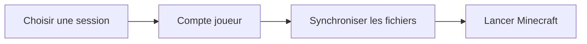

## Le problème traité

Rejoindre un serveur Minecraft demande de gérer un compte, une version du jeu, les ressources nécessaires et les mises à jour. Launched réunit ce parcours dans une application desktop dédiée.

## La réponse technique

- Une interface React dans une application Tauri.
- La sélection de sessions et de serveurs Minecraft.
- La synchronisation des fichiers avant le lancement du jeu.
- La gestion des comptes et des paramètres de session.

## Flux principal

## Point d'attention

Le lanceur coordonne une interface web et des opérations natives. Le parcours doit rester compréhensible pendant la synchronisation, même lorsqu'un serveur ou un téléchargement répond lentement.
