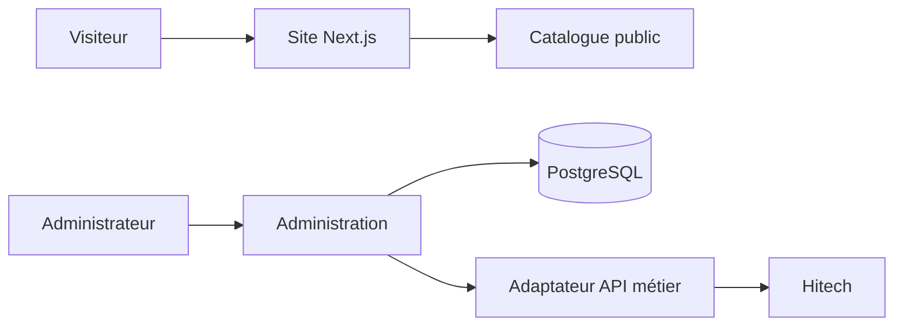

## Relier un site public à des données métier

Loc'Evasion 14 présente ses services de location et de navette sur le web. Le projet comprend aussi un catalogue de véhicules administrable et une couche serveur qui dialogue avec l'API métier existante.

## Ce que couvre le projet

- Des pages publiques pour les offres, les agences et les trajets.
- Un catalogue de véhicules avec gestion des images et des états de publication.
- Une authentification pour les outils d'administration.
- Une passerelle API côté serveur, avec cache et coordination des accès aux données externes.

## Flux simplifié

## Point d'attention

Les données visibles sur le site ne doivent pas être inventées lorsqu'un service métier ne répond pas. Le catalogue et les erreurs techniques ont donc des états distincts pour garder le parcours compréhensible.
