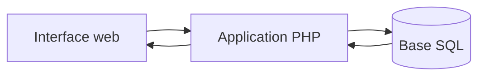

## Un projet complet

La SAE 301 couvre le cycle d'une application web : conception de la donnée, logique métier côté serveur et intégration d'une interface exploitable par l'utilisateur.

## Responsabilités travaillées

- Modélisation et utilisation d'une base SQL.
- Développement de fonctionnalités côté PHP.
- Intégration frontend et échanges avec le serveur.
- Organisation du travail collectif avec Git.
- Premières mesures de protection contre les injections SQL et les attaques XSS.

## Architecture

