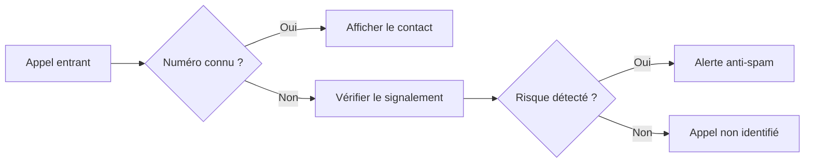

## Le besoin

YCallMe explore une gestion des appels plus lisible, avec une séparation claire entre les contacts connus, les numéros à vérifier et les appels potentiellement indésirables.

## Ce que j'ai construit

- Une application Android développée nativement en Kotlin.
- Une interface pensée pour consulter rapidement l'état d'un appel.
- Des traitements asynchrones pour ne pas bloquer l'expérience mobile.
- Une base d'architecture qui permet d'ajouter de nouvelles sources de détection.

## Ce que ce projet démontre

Ce projet me permet de travailler l'architecture d'une application mobile, les contraintes du système Android et la présentation de données qui doivent être comprises en quelques secondes.

